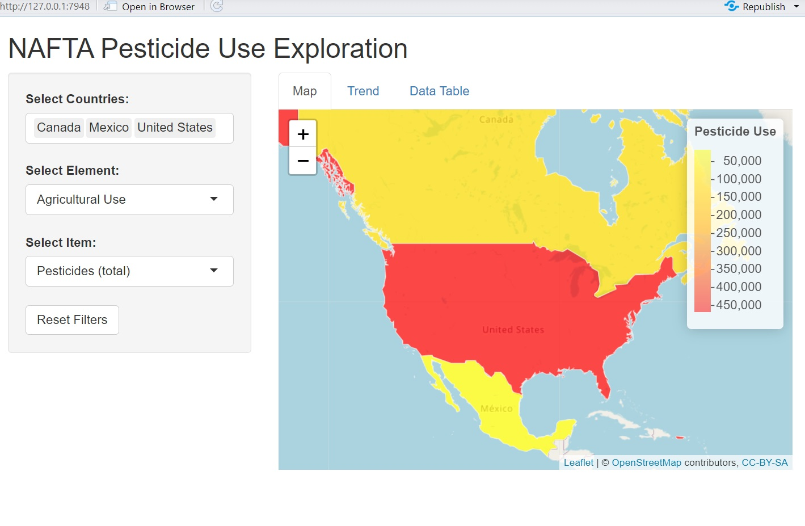

# NAFTA_Pesticide_Use
Shinny App to explore and visualize pesticide usage across NAFTA countries.
## Introduction

This document provides an overview of the NAFTA Pesticide Use App, which was designed to explore and visualize pesticide usage across NAFTA countries. The app offers interactive mapping, trend analysis, and detailed data tables, allowing users to examine pesticide usage over time and across different regions.

Despite its functionality, the app is too CPU and memory-intensive for deployment in its current form. Therefore, we provide static images to illustrate its key features.

## App Features

### 1. Pesticide Use Map (2022)

The interactive map displays pesticide usage across NAFTA countries (Canada, United States, and Mexico) for the year 2022. It uses a color palette ranging from yellow to red to indicate varying levels of pesticide application, with darker shades representing higher usage. Users can hover over each country to view detailed information, including the country name, year, and pesticide use value.

### 2. Pesticide Use Trend Graph

This feature provides a line graph showing the trend of pesticide usage over time for selected countries. Users can select specific elements and items to see how pesticide application has evolved. The graph is color-coded by country, providing a clear visual comparison of trends between Canada, the United States, and Mexico.

### 3. Pesticide Use Data Table

The data table presents a detailed view of the pesticide usage data. Users can filter the table by countries, elements, and items to see specific information for each year. This feature allows for an in-depth exploration of the dataset, facilitating further analysis and understanding of pesticide use patterns.

## Conclusion

The NAFTA Pesticide Use App offers a comprehensive tool for exploring pesticide usage data across NAFTA countries. While the current version of the app is too resource-intensive for deployment, the static images provided here showcase its powerful capabilities. Future optimizations could allow for a more lightweight version suitable for web deployment, enabling wider accessibility and use.
